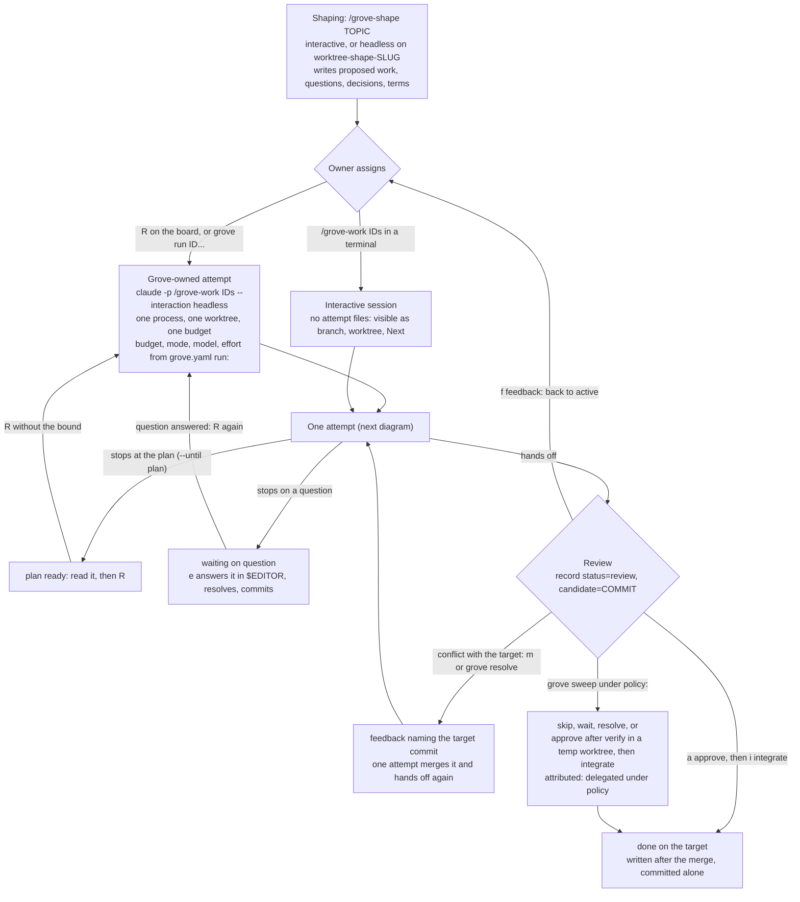
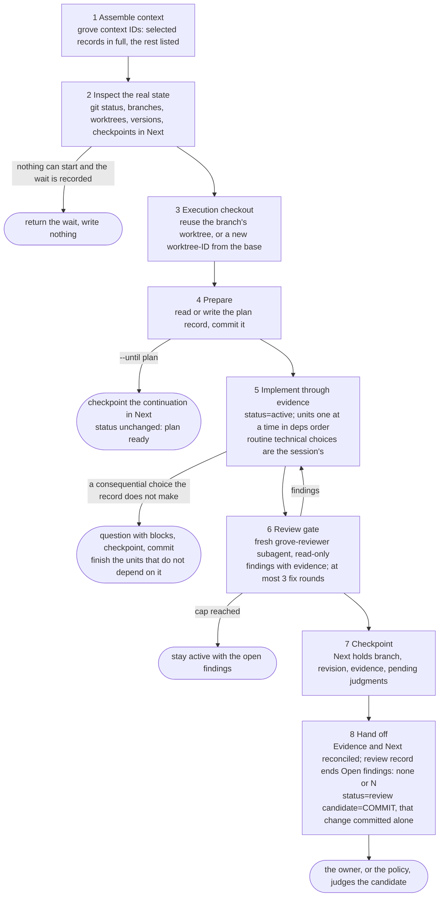

## The loop as it runs today

Observed at main `6fbb888`, 2026-09-28, from [the work guide](../docs/work-execution.md),
[the board](../docs/board.md) and [the commands](../docs/commands.md). Nothing
here is proposed: those three documents own the workflow, and this page is
redrawn from them when it changes. The owner asked for it on 2026-09-28 as
an artifact to reason about workflow changes against. GitHub renders the
Mermaid; the board shows it as a code block.

### From a proposal to the target

Sweep runs only when a person or a scheduler runs `grove sweep`; a finishing
attempt does not start one. Several IDs in one launch are one attempt on one
branch and hand off together on one shared candidate.

### Inside one attempt

Budget exhaustion or a stop ends everything at any step with what is
committed kept. A started unit left incomplete holds every unit on the branch
out of review; a unit that never started keeps its wait. The reviewer is the
only subagent; every other step runs in the one session.
