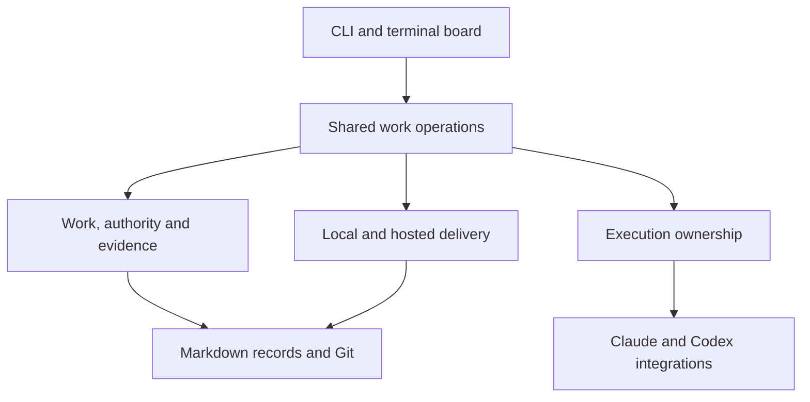

## Status and ownership

Accepted architecture baseline for
[G-260930-62nmj](G-260930-62nmj-design-the-portable-work.md). On 2026-09-29
(owner's local date), the owner reviewed this design and the experience
sketches at commit f376a6dab7a5999560b25adaacb93d919c36e7a8 and said:
"I've reviewed the designs and I accept them."

The [experience design](G-260930-npw49-portable-workflow-experi.md) owns the
screens; the [brief](brief.md) owns direction. Existing code is observed at
main 9b5c5a55f355. Acceptance establishes the implementation baseline; it does
not claim the new behavior is implemented. Field spelling, package names
and examples remain illustrative where the design says so. The current
schema 3 contract stays in force until its planned migration is delivered.

The owner selected derived completion with a redesigned record contract in
[G-260930-2qa4a](G-260930-2qa4a-derive-done-from-recorde.md), resolving
[G-260930-y6fyy](G-260930-y6fyy-should-completion-be-der.md). The design below
implements that choice on paper and now has the owner's acceptance.
Technical field spelling and package layout can be settled in the
implementing item's plan within these contracts. Descriptions labelled
proposed below describe intended implementation, subject to the explicit
trial and reconsideration criteria; they are not unresolved owner gates.

## Approach and alternatives

| Approach | Benefit | Cost for this milestone |
| --- | --- | --- |
| Add provider/host flags within current code | Small initial patches | Keeps ownership, provider protocol and presentation coupled; fails to establish a shared continuation/delivery contract |
| Refactor and replace selected subsystems | Retains useful record/Git behavior while letting the complete journey determine boundaries | Requires deliberate migration and behavioral tests across the boundaries |
| Replace the application in a fresh implementation | Freedom to choose all interfaces together | Must rebuild record safety, Git views, terminal lifecycle and recovery before demonstrating a better experience |

Recommend selective rebuilding. It does not require preserving current
function signatures. Escalate to wider replacement if the complete local
proof requires duplicate authoritative state or pervasive incompatible
assumptions. Compare concrete adaptation and replacement work at that point;
do not use line count or sunk effort as the decision criterion.

## Responsibilities



This is a responsibility map, not a plugin API or a mandate for one package
per box. Dependency direction matters: domain operations must not import
terminal presentation or decode provider event formats.

| Responsibility | Owns | Does not decide |
| --- | --- | --- |
| Project/work storage | Records, identities, revisions, validation, lock-protected writes, exact Git sources | Which proposal the owner assigns |
| Shared work operations | Preview/assign, inspect standing, answer, continue, request review, approve/feedback, prepare/deliver/reconcile | Product choices outside the recorded mandate |
| Execution ownership | One writer, process lifetime, worktree, interruption, local operation recovery | Whether the work is accepted |
| Harness integration | Capability probe, invocation, event decoding, stop behavior, native session compatibility | Work lifecycle or delivery authority |
| Delivery integration | Prepare result, verify target/head, perform or observe delivery, retain correspondence evidence | Whether unrelated host requirements may be bypassed |
| Presentation | Summaries, evidence drill-down and available actions | A second editable lifecycle or a provider-specific interpretation of success |

The application layer uses narrow typed operations, not an arbitrary DAG
engine. Begin by extracting the actual operations that CLI and TUI share.
A provider integrates by meeting the supported contracts; it need not expose
every other provider's features. A public third-party extension API can be
considered only with concrete implementations and demand.

## Contract 1: assignment

An assignment is an explicit mandate bound to the work it authorizes.
The durable representation records:

- selected work IDs and input revisions, dependency order and available base;
- outcome/acceptance context revision and the operation's authority;
- activity boundary, selected role settings and effective resource limits;
- repository/checkout identity and any applicable policy revision;
- who authorized it and how the operation can safely be retried.

Illustrative values, not a wire schema:

```text
Work:                the "Hide completed tasks" record at revision R
Base:                target commit B
Allowed:             implement this outcome; run named checks; request review
Boundary:            hand back a reviewed result
Not delegated:       change acceptance; publish; approve; integrate
Execution:           configured Claude role
Review:              configured Codex role
Limits:              effective provider-specific bounds shown to the owner
```

Preview checks readiness and capabilities without starting anything.
Assign rechecks the preview's facts under the appropriate locks and records
the mandate before launching. Repeated submission of the same operation
cannot create two owners. A durable recovery journal under the Git common
directory handles interruption between filesystem/process steps; it is not
the authority for accepted or delivered work.

A capability or permission change between preview and launch fails visibly.
Configuration in an untrusted working branch cannot silently broaden a
standing target policy. Changing the mandate creates a new attributed
revision; an agent cannot expand its authority by editing its own record.

## Contract 2: checkpoint and continuation

The checkpoint supplies facts needed by another session:

- mandate and plan revisions; branch/base/current commit and dirty-state fact;
- completed steps with evidence, pending changes, remaining work and questions;
- decisions and constraints the next activity needs, with source links;
- verification inputs/results and unresolved findings;
- last operation/attempt reference and whether any process may still own work.

A checkpoint's prose can explain reasoning. Fields that determine readiness,
ownership or completed checks must be mechanically readable and validated.
Proposed storage is a structured portion of the existing work/plan records,
with the smallest schema addition the implementation needs; do not add an
editable duplicate under local attempt logs.

Continue validates actual repository state, rebuilds activity-appropriate
context, and supplies it to the selected harness. Every source included
names its revision. Retrieval remains staged; a listing is not a reading.
A changed source must be read and reconciled before acting on it.

A fresh clone can continue only when the committed work branch/checkpoint
and required evidence objects have been transferred. Missing objects are
named as missing. Uncommitted edits and a lost machine's raw logs cannot be
recovered by a promise in a record. A crash with no current checkpoint
requires inspection/reconciliation of partial work, not a manufactured
successful checkpoint.

Native resume is an optional provider-specific optimization. Its binding
includes provider, project and compatible checkout/session identity.
Cross-provider continuation uses the durable checkpoint, never a foreign
native session ID. Stable planning and implementation may remain in one
session; role switches and independent review establish explicit boundaries.

## Contract 3: review and approval

A candidate is an exact commit C with the mandate/context used to judge it.
The candidate remains immutable. The independent reviewer receives:

- C (or a precise base-to-C comparison), work acceptance and applicable plan;
- relevant project constraints and previous findings;
- allowed verification commands and a protected/disposable environment;
- chosen provider/model/effort and effective limits.

The outcome records examined commit, findings with evidence, verification
references, provenance and complete/incomplete review state. A provider's
closing sentence cannot alone be proof that all those inputs were checked.
Grove validates the result before treating the independent-review
requirement as satisfied. Review failure never becomes an empty findings list.

Approval binds C, the acceptance/context revision and the authorizing person
or policy. It is separate from the review and from delivery. Feedback
withdraws approval for continued implementation and preserves prior evidence.

Review and approval evidence often arrives after C. Define a narrow,
validated allowance for those later artifact changes; do not exempt the
whole record root from candidate freshness. A changed outcome, acceptance,
plan constraint, executable file or configuration may require a new candidate
or renewed judgment. Artifact-only updates must not permit arbitrary code
or instruction changes to enter under approval of C.

## Contract 4: delivery and transformed identity

The invariant is acceptance of C plus evidence that its approved result
reached the configured target. For a shared candidate, every affected work
item must have applicable approval. Host checks can add requirements.

Proposed delivery preparation binds:

- candidate C and exact approval/review/mandate revisions;
- current target base B and the intended merge/squash method;
- final submitted tip S, including only validated supplemental artifacts;
- predicted resulting tree T and verification of that result;
- identity of the local operation or hosted PR, plus retained evidence refs.

Concrete local sequence:

1. Read approval and target B; retain the candidate and evidence.
2. Form the allowed submission S and compute its result against B.
3. Verify the actual proposed result. If B or S changes, invalidate that
   verification and prepare again.
4. Create the squash commit D and advance the target only if it still
   matches B. D's content must match the prepared result.
5. Observe D on the target and record/reconstruct correspondence. An
   interruption between steps is reconciled using existing Git facts.

Concrete hosted sequence:

1. Publish/link the exact prepared submission only under explicit authority.
2. Bind the PR head and target to the prepared inputs. Observe host checks
   and approval requirements without claiming they are Grove approval.
3. If the head changes, reconcile it; if the target changes, reverify the
   integration result. Do not silently transfer old approval to new code.
4. Observe the merged commit D and verify content correspondence. A merge
   performed by someone else uses the same reconciliation operation.
5. Report delivered, waiting, rejected, or evidence unavailable. A merged PR
   label alone is insufficient.

Use the full predicted Git tree for the final verification where possible,
including the submitted metadata. Special metadata fields need an explicitly
specified normalization and independent validation; a blanket "ignore
grove/" diff is unacceptable. Candidate changes and generated evidence must
not form a self-referential hash cycle.

A delivery descriptor may contain stable inputs and be carried in the final
submission, with the containing commit supplying its eventual identity.
It must not contain its own final commit hash. Trailers can locate that
descriptor; they are not proof. Exact serialization and proof fixtures are
part of the local-delivery implementation plan.

### Completion representation: recorded acceptance and its delivery

Selected model: [G-260930-2qa4a](G-260930-2qa4a-derive-done-from-recorde.md),
amended by [G-260930-gj9d7](G-260930-gj9d7-prove-delivery-once-at-i.md).
The record owns what was proposed, worked on, offered for judgment and
accepted. Git supplies the observed delivery fact. Done is derived from
applicable acceptance plus its delivery, without a mandatory done
commit or follow-up completion PR. Delivery is proved once, when it is
made, and again only by an audit a person runs; reading does not re-prove
it. The semantic contract below is proposed
for implementing that decision; it is not schema 3 syntax.

**Persisted facts.** Represent the work's preparation/implementation phase,
the exact candidate, and acceptance or withdrawal with its authority and
acceptance-context identity. Accepted is an explicit recorded fact that
remains true before and after delivery. Awaiting judgment only describes a
candidate without applicable acceptance. Remove the overloaded persisted
work status that currently purports to describe the entire lifecycle; do
not retain status=review on accepted work. Other record types keep their
own distinct statuses. The implementation plan specifies serialization and
schema revision, with validation rejecting contradictory combinations.

Acceptance binds the outcome, acceptance criteria and relevant constraints,
not the hash of a mutable file containing its own acceptance. Supplementary
review/approval metadata has the narrow validated allowance in Contract 3.
Changing candidate or governed requirements withdraws applicability; it
cannot inherit Done from an old candidate. Historical judgments remain
inspectable. Explicit abandonment and feedback retain their authority rules.

**Observed facts.** An acceptance reaches the target only through a
delivery, so the observation is the target tip's own copy of the record, at
the same path: accepted for the same candidate, or not. It names the target
and the tip examined. Hosted mode names the configured remote target, not an
ahead-of-remote local branch called main. The observation is read from Git
in one step whatever the history, not a second editable lifecycle in a
database or cache. Local observations are current only for the examined
tip; remote observations also name their last refresh and whether remote
freshness is known.

| Current recorded facts | The target's copy at the examined tip | Presented standing/action |
| --- | --- | --- |
| Proposed or active; no accepted candidate | Any | Proposed or active, with execution/question facts |
| Candidate offered; no applicable acceptance | Any | Awaiting judgment; code presence cannot supply approval |
| Accepted candidate | Absent, or not accepted for that candidate | Ready or waiting to deliver; show any known host wait |
| Accepted candidate | Accepted for the same candidate | Done at the named target revision |
| Accepted candidate | The target cannot be read | Accepted; delivery unknown |
| Explicitly abandoned | Any | Abandoned; history remains inspectable |

A received approval alone does not establish Done. A local target can be
checked without a network; an offline hosted view may report Done as of the
last read revision with freshness unknown, never assert present remote
state. An operation needing current delivery must refresh explicitly or
wait. The accepted trade: an acceptance written on the target by hand reads
as done. The audit proves each delivery from the retained evidence on
request; a shallow clone or a missing retained object is reported there as
not auditable, never as proof.

**One result for all consumers.** A shared read operation returns recorded
facts, effective standing, target/source revisions,
freshness, wait reasons and permitted next actions. CLI list/show/context,
JSON output, board, dependency checks, attempt launch/continue, approval,
policy sweep, integration and cleanup use it. Raw source remains available
and clearly labelled; effective state is never substituted into original
Markdown bytes while presenting them as the file. Inspecting reads local
facts without writing records or silently fetching, pushing or starting work.

A direct-file reader sees acceptance and its candidate but must inspect Git
or Grove to determine delivery. Updated guides and context explain that
boundary. Tests must exercise agents starting with direct Markdown as well
as context, rather than assume all callers use the board. Historical copies
and stale worktrees name their source; unresolved current-record divergence
cannot silently select whichever copy makes an action possible.

**Readiness and mutation.** Current applicable acceptance and delivery must
both be established to satisfy a new completion prerequisite. Execution also
checks that the chosen base's own copy of the record is accepted for the
same candidate as the target's; delivery to the target does not make an
older worktree ready. Unknown waits, and a stale
previous acceptance cannot satisfy a reopened prerequisite. Preview is
read-only; mutation rechecks the relevant record revisions, target, evidence
and ownership before effects. Inspecting or retrying cannot duplicate
implementation or integration already accounted for by those facts.

**Local and hosted closure.** Record acceptance and retain its evidence
before delivery; carry the accepted record and stable delivery descriptor
in the prepared submission. The target update then contains everything
needed to discover and audit correspondence. The containing commit supplies
its eventual delivery identity; a descriptor never embeds its own hash.
The final submitted tip and resulting tree may be retained outside that
descriptor to avoid a self-reference. Verify the complete prepared result,
including controlled supplementary metadata, against the delivered tree.
No broad record-directory exclusion is allowed.

If delivery succeeds and the process dies, reading finds Done in the
target's copy of the record. A cache or cleanup failure does not require
another target commit. An external merge reads the same way; the audit
proves it, and insufficient transferred evidence is reported there as not
auditable with an evidence-recovery path, never a fabricated correspondence. A closed-unmerged
PR, successful provider exit or unverified trailer cannot close work.

The local-delivery item owns this record redesign and every existing
lifecycle consumer needed to keep the current Claude workflow coherent.
Portable execution builds on it; the hosted adapter supplies the remote
observation/transport, not another completion state machine. The later
experience item improves presentation without postponing shared correctness.

**Required examples.** Exercise accepted-before-delivery, ordinary and squash
delivery, an external merge, a crash just after target advance, moved target,
changed candidate/requirements, feedback after delivery, shared candidates,
missing evidence, shallow/fresh clones, stale worktrees and policy actions.
Both tool and raw-file entry paths must avoid duplicate work and false Done.
Research/design work uses an accepted Git artifact candidate delivered to the
target; its acceptance evidence is judged for that deliverable, not inferred
from whether code changed. Legacy completion is handled by migration below.

### Retention, fresh clones and reversals

Pin the candidate and its review/approval evidence under durable Git refs
before deleting execution branches. Proposed implementation uses ordinary
evidence branches with a Grove-managed namespace so transport can use
standard Git; exact names and transfer policy remain design details.
A local ref alone is not a remote backup and is not automatically available
to another clone. Publishing evidence is an explicit part of authorized
hosted delivery; local export/clone instructions must include retained refs.

Retained evidence refs must be identified as evidence sources, not competing
live work branches that can resurrect an earlier phase on the combined board.
Keep them inspectable. Verified delivery correspondence may connect equivalent
submitted and integrated records; it cannot make the target authoritative over
a genuine later edit or erase divergent feedback. Test the current view after
squash, branch cleanup, retained-ref transfer and reopening on another branch.

Retain these refs through ordinary garbage collection. Show missing evidence
when a user or host removes them; a trailer cannot recreate deleted objects.
Core inspection reads local objects and never silently fetches or pushes.

Delivery is a historical fact at D, with current target reachability checked
separately. A force-rewritten target that no longer contains D cannot support
a claim of current delivery. As amended by
[G-260930-gj9d7](G-260930-gj9d7-prove-delivery-once-at-i.md), done is what
the target's record says: reverting D reverts the record with the code, so
the work reads as it did before delivery and can be delivered again, while a
later code revert that leaves the record does not erase that a delivery
occurred; link any new corrective work rather than reimplementing it. Arbitrary later
semantic regression cannot be inferred from a commit message alone.

## Contract 5: capabilities and failure semantics

| Capability | What the integration must expose |
| --- | --- |
| Executable/version/auth readiness | Detected, missing, incompatible or unknown, with probe source |
| Model and effort | Requested and effective values, or explicitly unreported |
| Resources | Limit kind, scope, enforcement mechanism, usage reports and gaps |
| Permissions | What is enforced, what needs interaction, and what is only guidance |
| Cancellation | Stop request, escalation behavior and final observed ownership |
| Independent review | Supported isolation route and required verification environment |
| Interactive launch | Context seeding behavior and whether it submits a paid turn |
| Native resume | Compatible binding or an explicit fresh-continuation route |

Provider-specific probes are rechecked at implementation against supported
installed versions; this design makes no new claims about current provider
flags. An unsupported required capability stops before spending.
Reported tokens are not exact cost. An elapsed-time ceiling is not a spend
ceiling, and an account-wide allowance is not a reliable per-attempt cap.

Every mutating shared operation returns facts that completed, the resulting
standing, and a precise failure/wait reason. Idempotent retry and partial
success are part of the contract. Do not wrap all multi-step Git/process
effects in a fictional transaction that cannot roll back an external merge.

## Mechanical enforcement and agent judgment

| Today | Proposed responsibility |
| --- | --- |
| Runner enforces single owner and stop; guide directs checkpoint prose | Keep mechanical ownership; validate continuation facts through shared operations |
| Guide tells agent to seek independent review and write handoff | Review operation binds inputs and validates output; agent supplies analysis/findings |
| CLI checks candidate/status and policy reads review closing text | Shared standing evaluates evidence freshness/completeness; review text remains inspectable |
| Guide asks agent to recognize consequential missing choices | Agent identifies the choice; Grove persists the question and enforces its wait |
| Agent chooses implementation details and explains tradeoffs | Keep judgment in the session under its mandate |
| TUI and commands assemble many presentation facts | Both consume one standing/actions result with evidence references |

Do not build a central engine that dictates every coding step. Enforce
authority, identity, ownership, freshness, waits and delivery where the
system can check them. Use behavioral evaluations for judgments software
cannot prove.

## Refactoring map and implementation ownership

| Existing area | Proposed treatment | Work owner |
| --- | --- | --- |
| internal/repo, create, record parser and revision/write-lock tests | Retain safety behavior; change the work record contract and migration explicitly | Local delivery |
| internal/versions and deps | Retain batched reads, ancestry and exact-source checks; share delivery relation instead of duplicating ancestry-only completion checks | Local delivery |
| internal/attempt | Separate provider protocol/session from common process/worktree ownership; replace APIs as needed | Portable execution |
| internal/handoff and work guide | Preserve staged retrieval; expose truthful recorded and derived standing now, then add structured continuation | Local delivery for standing; complete local proof for continuation |
| update review operations and review guide | Bind candidate/context, independent findings and approval; allow only controlled later artifacts | Independent review and local delivery under the accepted design |
| internal/integrate, update completion, sweep | Share prepare/verify/deliver/reconcile; preserve policy authority and failure facts | Local delivery, then hosted delivery through that contract |
| internal/tui Backend and CLI adapters | Consume common standing/actions as part of the lifecycle change; later rebuild primary views and setup | Local delivery for correctness; cohesive experience for the assembled UX |
| init and entrypoint templates | Preserve conflict-safe adoption; add capability/settings guidance through shared setup operations | Cohesive experience |
| evals and regression fixtures | Keep mechanical regressions; add cross-harness continuation and independent-adoption evidence | Complete local proof and milestone |

Local delivery also adapts lifecycle callers in internal/attempt, preserving
the existing Claude execution behavior. Portable execution depends on that
item because its selection, attempt reporting, resolution and context would
otherwise be refactored against a disappearing status contract. Independent
review follows portable execution. These orders are encoded in depends_on;
no unrecorded parallel assignment is implied. The first implementation
result remains observable local delivery, not an isolated framework refactor.

## Migration and verification

Existing schemas and CLI contracts remain in force during design.
Implementation must provide an explicit versioned migration if new fields
or lifecycle semantics require it. Show a dry run, preserve IDs/paths and
historical evidence, retain a recoverable Git reference, and refuse ambiguous
conversion. Migration does not require a promise to read every old schema
forever; old commits remain inspectable with their corresponding CLI.

Migration classifies records before writing. Proposed/active/abandoned
retain their meaning; review without approval becomes awaiting judgment;
review with valid approval becomes recorded acceptance. Existing done with
complete applicable approval and delivery evidence can be proved by the audit.
Older done records without that evidence retain an explicitly labelled
historical completion claim and the original provenance. Do not invent a
candidate or acceptance, silently reopen them, or present them as freshly
verified under the new guarantee. Preserve their existing dependency
semantics, including branch/base constraints, in a bounded migration case;
new records cannot create that legacy exemption. Ambiguous data is reported
for reconciliation rather than guessed.

Migration does not rewrite Git history or every old branch. Old snapshots
remain readable with their matching binary; unsupported mixed-schema live
branches are refused with a deliberate migration/rebase path. Change the
schema contract explicitly rather than relabel schema 3 in place. Update
the repository policy, shipped model/guides, init entrypoint revision where
needed, filters and CLI/JSON consumers in the same delivering item. The
current repository policy remains in force until that implementation lands.
Existing native sessions remain local and optional; a missing session
cannot invalidate committed work.

Retain meaningful regressions for source replacement, stale writes,
environment isolation, lock contention, duplicate owners, stop escalation,
target movement, candidate groups, terminal restoration and policy bounds.
Reconsider tests that merely freeze Claude argument bytes, a particular
package layout or ancestry-only completion after the owner accepts the
replacement contract.

Add behavioral assertions for changed mandate, missing checkpoint, unanswered
question, fresh-clone continuation, stale approval, altered delivery claims,
supplemental metadata abuse, cleanup/GC retention and external squash merge.
Run deterministic tests before bounded real-provider trials, and record
which conclusions require actual agent behavior or the owner's judgment.

The complete local proof consumes the provider, review and local-delivery
work under their declared dependencies. Its evidence determines whether
these boundaries are workable; any substantial redesign is recorded and
reconciled before dependent work relies on it.
