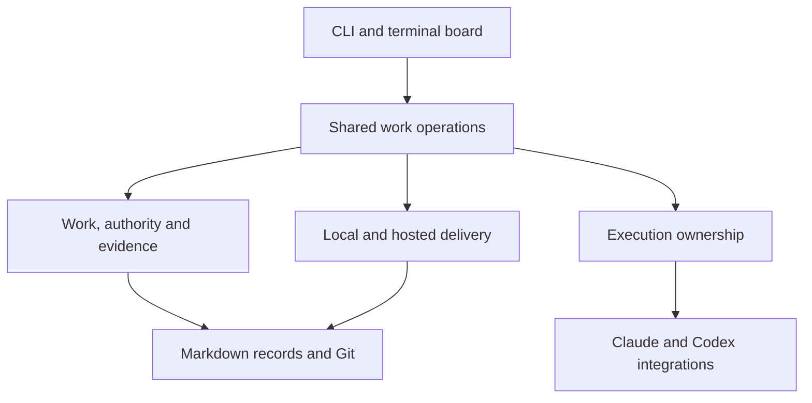

## Status and ownership

The owner accepted the original written architecture and experience design
at f376a6d on 2026-09-29 (local date). On 2026-09-30 they reconsidered its
delivery and execution scope after the local-delivery implementation and
selected [G-260930-tcc9w](G-260930-tcc9w-bound-delivery-groups-an.md).
On 2026-09-30 they also authorized
[G-261001-fg05z](G-261001-fg05z-simplify-workflow-bounda.md) after reviewing
the workspace implementation's churn: settle the local walkthrough, separate
blocking review findings from follow-ups, and isolate workspace eligibility
before provider extraction. This revision reconciles those selected boundaries. Preparation, recovery
and interface details below are proposed implementation design for review;
the owner's decisions do not claim those details have been implemented.

The [brief](brief.md) owns direction, this page owns contracts and component
responsibilities, and the [experience design](G-260930-npw49-portable-workflow-experi.md)
owns interaction examples. The [milestone](G-260930-60c3d-complete-the-portable-gr.md)
owns membership, readiness and trials. Shipped command/model documentation
describes current behavior until replacement code is delivered.

Observed at main 18ba791: schema 4, recorded acceptance, cheap derived Done,
local squash delivery and optional audit are implemented. A multi-item run
still has one shared candidate; cleanup is opt-in; kept branches can be
delivered again after merging the target. Automatic progression across
separate deliveries and the LLM judge are not implemented. These are the
specific gaps to change, not reasons to repeat the lifecycle migration.

## Approach and alternatives

| Approach | Benefit | Cost for this milestone |
| --- | --- | --- |
| Add provider/host flags within current code | Small initial patches | Keeps ownership, provider protocol and presentation coupled; fails to establish a shared continuation/delivery contract |
| Refactor and replace selected subsystems | Retains useful record/Git behavior while letting the complete journey determine boundaries | Requires deliberate migration and behavioral tests across the boundaries |
| Replace the application in a fresh implementation | Freedom to choose all interfaces together | Must rebuild record safety, Git views, terminal lifecycle and recovery before demonstrating a better experience |

Recommend selective rebuilding. It does not require preserving current
function signatures. Escalate to wider replacement if the complete local
proof requires duplicate authoritative state or pervasive incompatible
assumptions. Compare concrete adaptation and replacement work at that point;
do not use line count or sunk effort as the decision criterion.

## Responsibilities



This is a responsibility map, not a plugin API or a mandate for one package
per box. Dependency direction matters: domain operations must not import
terminal presentation or decode provider event formats.

| Responsibility | Owns | Does not decide |
| --- | --- | --- |
| Project/work storage | Records, identities, revisions, validation, lock-protected writes, exact Git sources | Which proposal the owner assigns |
| Shared work operations | Preview/assign, inspect standing, answer, continue, request review, approve/feedback, prepare/deliver/reconcile | Product choices outside the recorded mandate |
| Execution ownership | One writer, process lifetime, worktree, interruption, local operation recovery | Whether the work is accepted |
| Harness integration | Capability probe, invocation, event decoding, stop behavior, native session compatibility | Work lifecycle or delivery authority |
| Delivery integration | Prepare result, verify target/head, perform or observe delivery, retain correspondence evidence | Whether unrelated host requirements may be bypassed |
| Presentation | Summaries, evidence drill-down and available actions | A second editable lifecycle or a provider-specific interpretation of success |

The application layer uses narrow typed operations, not an arbitrary DAG
engine. Begin by extracting the actual operations that CLI and TUI share.
A provider integrates by meeting the supported contracts; it need not expose
every other provider's features. A public third-party extension API can be
considered only with concrete implementations and demand.

## Contract 1: assignment

An assignment is an explicit mandate bound to the work it authorizes.
The durable representation records:

- selected work IDs and input revisions, dependency order and delivery mode;
- target/base, group membership, cleanup preference and available inputs;
- outcome/acceptance context revision and the operation's authority;
- activity boundary, selected role settings and aggregate resource limits;
- permission to continue across deliveries and applicable approval policy;
- repository/checkout identity and any applicable policy revision;
- who authorized it and how the operation can safely be retried.

Illustrative values, not a wire schema:

```text
Work:                the "Hide completed tasks" record at revision R
Base:                target commit B
Allowed:             implement this outcome; run named checks; request review
Boundary:            hand back a reviewed result
Not delegated:       change acceptance; publish; approve; integrate
Execution:           configured Claude role
Review:              configured Codex role
Limits:              effective provider-specific bounds shown to the owner
```

Preview checks readiness and capabilities without starting anything.
Assign rechecks the preview's facts under the appropriate locks and records
the mandate before launching. Repeated submission of the same operation
cannot create two owners. A durable recovery journal under the Git common
directory handles interruption between filesystem/process steps; it is not
the authority for accepted or delivered work.

A capability or permission change between preview and launch fails visibly.
Configuration in an untrusted working branch cannot silently broaden a
standing target policy. Changing the mandate creates a new attributed
revision; an agent cannot expand its authority by editing its own record.

### Delivery boundaries and execution base

The assignment chooses one of two modes, visible before launch:

| Mode | Delivery boundary | Progression |
| --- | --- | --- |
| Separate (default) | One selected work item per candidate/delivery | Review, approve and deliver it, then start the next ready member from the updated target |
| Together (explicit) | The selected members share a candidate, judged per member | Implement in dependency order on one workspace and deliver the completed group once |

Both modes use the same work, review, approval and delivery operations.
There is no arbitrary grouping language, automatic regrouping or splitting
of unfinished code. Existing assignments keep their recorded shared boundary;
an older attempt without a mode is not silently reinterpreted as separate.
Preview makes the changed default explicit for new assignments.

Every new delivery workspace starts from the current configured target.
Prerequisites outside that delivery group must already be delivered into
that base. Members of a together group may build on earlier members'
unmerged changes. Independently managed unmerged implementation branches
are not execution bases. Read-only inspection of such branches stays usable.

**Proposal admission (proposed mechanism).** Selected records may exist only
on a shaping branch. Preview names their committed source revisions and the
bounded set of record/knowledge inputs needed to make them valid. Preparation
copies those exact snapshots into the fresh target-based workspace, keeping
IDs and paths and recording source provenance; it never merges the source
branch or imports its code, configuration, harness instructions or unrelated
records. Required non-record documents are named and reviewed as assignment
inputs, not taken through a whole-directory exemption. A differing target
copy, changed source, unresolved relationship or dependency on excluded code
requires reconciliation before launch. Uncommitted files remain with their
current writer. Admission is part of the candidate branch, so it requires no
separate metadata-only target commit or PR. Checks validate the resulting
project before any agent spends. Implement and trial this bounded admission
path rather than solving every possible branch transplant.

**Workspace lifetime.** Before delivery, resume, review fixes and conflict
resolution reuse the same workspace. After delivery, that workspace is
retired from execution; repeated delivery from a squashed branch is
explicitly unsupported. A reopened work item gets a new execution identity
and workspace from the updated target, retaining its earlier evidence.
Names must not collide with a kept workspace for the same work ID. A kept
workspace is inspectable; later edits remain visible and preserved but do
not make it eligible for another delivery. No special continuation merge
base or automatic repair of such a branch is required.

Cleanup is automatic unless the assignment says keep. It runs only after
delivery is observed, required evidence is retained, and no owner can still
write. Delete only the exact completed branch/worktree when its tip has not
changed and it contains no additional committed, dirty or untracked work.
Replaced paths and uncertain ownership are preserved with a reason. Cleanup
failure never undoes Done or by itself blocks a safe fresh next workspace.
Receipt/ownership checks run at the mutation boundary, not by adding a
history walk to ordinary reads.

The [command operation table](../docs/commands.md#workspace-operation-table)
owns the current implementation's per-operation answers and limitations.
The workspace follow-up
[G-261001-62n4p](G-261001-62n4p-isolate-workspace-eligib.md) must map those
callers to common eligibility and ownership facts. Delivery may depend on
those facts without importing provider invocation/event handling. Its plan
must identify obsolete recovery rules removed and existing-assignment
compatibility retained; moving code alone does not demonstrate simplification.

## Contract 2: checkpoint and continuation

The checkpoint supplies facts needed by another session:

- mandate and plan revisions; branch/base/current commit and dirty-state fact;
- completed steps with evidence, pending changes, remaining work and questions;
- decisions and constraints the next activity needs, with source links;
- verification inputs/results and unresolved findings;
- last operation/attempt reference and whether any process may still own work.

A checkpoint's prose can explain reasoning. Fields that determine readiness,
ownership or completed checks must be mechanically readable and validated.
Proposed storage is a structured portion of the existing work/plan records,
with the smallest schema addition the implementation needs; do not add an
editable duplicate under local attempt logs.

Continue validates actual repository state, rebuilds activity-appropriate
context, and supplies it to the selected harness. Every source included
names its revision. Retrieval remains staged; a listing is not a reading.
A changed source must be read and reconciled before acting on it.

A fresh clone can continue only when the committed work branch/checkpoint
and required evidence objects have been transferred. Missing objects are
named as missing. Uncommitted edits and a lost machine's raw logs cannot be
recovered by a promise in a record. A crash with no current checkpoint
requires inspection/reconciliation of partial work, not a manufactured
successful checkpoint.

Native resume is an optional provider-specific optimization. Its binding
includes provider, project and compatible checkout/session identity.
Cross-provider continuation uses the durable checkpoint, never a foreign
native session ID. Stable planning and implementation may remain in one
session; role switches and independent review establish explicit boundaries.

### One authorized selection across deliveries

An on-demand owner advances the finite selected set through implementation,
independent review, applicable delegated judgment, delivery and cleanup.
It remains useful without the terminal open; no resident service or reboot
survival guarantee is added. The owner may invoke existing bounded repair
operations only under their written authority and limits.

In separate mode, delivery is the boundary that releases dependent work.
The owner re-reads target and selected inputs before starting the next fresh
workspace. It does not require another launch from the human when policy
permits progression. In together mode, every selected member must be complete
before the combined candidate is deliverable, including members not yet
started. A blocked member therefore holds the group's delivery; other ready
members may still execute one at a time. No partial group is delivered and
unfinished code is never automatically separated. Changing membership needs
a reconciled owner mandate. In separate mode, a question or failure holds
its dependent members while other ready selected members may proceed.
Stop or aggregate resource exhaustion ends further launch for the selection.

Persist the selected mode, inputs, authority, progress and remaining limits
before crossing process boundaries. Work records and target standing own
acceptance and delivery; the local operation journal coordinates launches,
not another work status. Recovery inspects these facts before resuming,
including target advance just before a crash. It cannot duplicate an owner,
redo a delivered member or reset the spending allowance. Missing accounting
or authority waits explicitly. A fresh clone can continue from transferred
project checkpoints after a fresh execution mandate; private logs never
silently convey remaining authority or an invented budget.

Unchanged waits and inspection start nothing. A human answer or acceptance
can be followed by an explicit Continue under the remaining mandate.
Automatic waking while no owner is running is not promised. Additional work,
changed grouping or expanded authority requires a new/reconciled mandate.

## Contract 3: review and approval

A candidate is an exact commit C with the mandate/context used to judge it.
The candidate remains immutable. The independent reviewer receives:

- C (or a precise base-to-C comparison), work acceptance and applicable plan;
- relevant project constraints and previous findings;
- allowed verification commands and a protected/disposable environment;
- chosen provider/model/effort and effective limits.

The outcome records examined commit, findings with evidence, verification
references, provenance and complete/incomplete review state. A provider's
closing sentence cannot alone be proof that all those inputs were checked.
Grove validates the result before treating the independent-review
requirement as satisfied. Review failure never becomes an empty findings list.

Selected follow-up, not current policy behavior:
[G-261001-mbjwz](G-261001-mbjwz-separate-blocking-review.md) distinguishes
acceptance/correctness blockers from tracked improvements. A documentation
defect that misstates supported behavior can block; a severity label cannot
waive acceptance. The complete report retains every finding and disposition.
An explicit, validated summary carries completeness and the two categories
to the policy consumer. Its exact representation and delegation compatibility
are implementation design, with no silent broadening of existing mandates.
Existing nonzero review counts cannot be reinterpreted as only follow-ups.
Repair reviews cover the changed rule, neighboring states and affected
callers; a changed lifecycle rule is reconciled before caller-specific fixes.

Approval binds C, the acceptance/context revision and the authorizing person
or policy. It is separate from the review and from delivery. Feedback
withdraws approval for continued implementation and preserves prior evidence.

Review and approval evidence often arrives after C. Define a narrow,
validated allowance for those later artifact changes; do not exempt the
whole record root from candidate freshness. A changed outcome, acceptance,
plan constraint, executable file or configuration may require a new candidate
or renewed judgment. Artifact-only updates must not permit arbitrary code
or instruction changes to enter under approval of C.

### Delegated approval judgment

The LLM judge is part of this milestone, per G-260930-tcc9w. It is a
separately configured and bounded policy condition, distinct from both the
implementer and independent review. It receives the exact candidate,
acceptance/context, reviews and verification evidence, and returns an
attributable structured approve/wait verdict with reasons per acceptance
item. It cannot waive checks, prohibited paths, host policy or an acceptance
item reserved for the human. A changed input invalidates the judgment.
Failed, incomplete or malformed judgment waits; it never becomes approval.
The selection's aggregate limits include these calls. No configured policy
means the assignment waits for human approval instead of manufacturing it.

## Contract 4: delivery and transformed identity

The invariant is acceptance of C plus evidence that its approved result
reached the configured target. For a shared candidate, every affected work
item must have applicable approval. Host checks can add requirements.

Proposed delivery preparation binds:

- candidate C and exact approval/review/mandate revisions;
- current target base B and the intended merge/squash method;
- final submitted tip S, including only validated supplemental artifacts;
- predicted resulting tree T and verification of that result;
- identity of the local operation or hosted PR, plus retained evidence refs.

Concrete local sequence:

1. Read approval and target B; retain the candidate and evidence.
2. Form the allowed submission S and compute its result against B.
3. Verify the actual proposed result. If B or S changes, invalidate that
   verification and prepare again.
4. Create the squash commit D and advance the target only if it still
   matches B. D's content must match the prepared result.
5. Observe D on the target and record/reconstruct correspondence. An
   interruption between steps is reconciled using existing Git facts.

Concrete hosted sequence:

1. Publish/link the exact prepared submission only under explicit authority.
2. Bind the PR head and target to the prepared inputs. Observe host checks
   and approval requirements without claiming they are Grove approval.
3. If the head changes, reconcile it; if the target changes, reverify the
   integration result. Do not silently transfer old approval to new code.
4. Observe the merged commit D and the configured remote target. Supported
   delivery verifies the prepared result; another person's merge of that
   prepared submission uses the same idempotent reconciliation operation.
5. Report acceptance, delivery standing, remote freshness and verification
   separately. A merged PR label alone is insufficient. Routine subsequent
   reading uses the target's accepted record, not a new proof of history;
   missing audit objects affect audit availability, not Done.

Use the full predicted Git tree for the final verification where possible,
including the submitted metadata. Special metadata fields need an explicitly
specified normalization and independent validation; a blanket "ignore
grove/" diff is unacceptable. Candidate changes and generated evidence must
not form a self-referential hash cycle.

A delivery descriptor may contain stable inputs and be carried in the final
submission, with the containing commit supplying its eventual identity.
It must not contain its own final commit hash. Trailers can locate that
descriptor; they are not proof. Exact serialization and proof fixtures are
part of the local-delivery implementation plan.

### Completion representation: recorded acceptance and its delivery

Selected model: [G-260930-2qa4a](G-260930-2qa4a-derive-done-from-recorde.md),
amended by [G-260930-gj9d7](G-260930-gj9d7-prove-delivery-once-at-i.md).
The record owns what was proposed, worked on, offered for judgment and
accepted. Git supplies the observed delivery fact. Done is derived from
applicable acceptance plus its delivery, without a mandatory done
commit or follow-up completion PR. Delivery is proved once, when it is
made, and again only by an audit a person runs; reading does not re-prove
it. This boundary is implemented in schema 4 and retained by the owner's
2026-09-30 decision; execution changes consume it without another migration.

**Persisted facts.** Keep schema 4's preparation/implementation phase,
exact candidate and attributable acceptance/context. Accepted remains true
before and after delivery; awaiting judgment describes a candidate without
applicable acceptance. Other record types retain their distinct statuses.
The shipped record model owns field spelling and validation; this design
does not create a second schema specification or require another revision.

Acceptance binds the outcome, acceptance criteria and relevant constraints,
not the hash of a mutable file containing its own acceptance. Supplementary
review/approval metadata has the narrow validated allowance in Contract 3.
Changing candidate or governed requirements withdraws applicability; it
cannot inherit Done from an old candidate. Historical judgments remain
inspectable. Explicit abandonment and feedback retain their authority rules.

**Observed facts.** Supported operations carry acceptance to the target
with its delivery. Normal reading trusts the target tip's record, at
the same path: accepted for the same candidate, or not. It names the target
and the tip examined. Hosted mode names the configured remote target, not an
ahead-of-remote local branch called main. The observation is read from Git
in one step whatever the history, not a second editable lifecycle in a
database or cache. Local observations are current only for the examined
tip; remote observations also name their last refresh and whether remote
freshness is known.

| Current recorded facts | The target's copy at the examined tip | Presented standing/action |
| --- | --- | --- |
| Proposed or active; no accepted candidate | Any | Proposed or active, with execution/question facts |
| Candidate offered; no applicable acceptance | Any | Awaiting judgment; code presence cannot supply approval |
| Accepted candidate | Absent, or not accepted for that candidate | Ready or waiting to deliver; show any known host wait |
| Accepted candidate | Accepted for the same candidate | Done at the named target revision |
| Accepted candidate | The target cannot be read | Accepted; delivery unknown |
| Explicitly abandoned | Any | Abandoned; history remains inspectable |

A received approval alone does not establish Done. A local target can be
checked without a network; an offline hosted view may report Done as of the
last read revision with freshness unknown, never assert present remote
state. An operation needing current delivery must refresh explicitly or
wait. The accepted trade: an acceptance written on the target by hand reads
as done. The audit proves each delivery from the retained evidence on
request; a shallow clone or a missing retained object is reported there as
not auditable, never as proof.

**One result for all consumers.** Shared standing returns recorded facts,
effective standing and target/source revisions without an audit. Operations
add their freshness checks, wait reasons and permitted actions; observing
Done is not a claim that an audit just ran. CLI list/show/context,
JSON output, board, dependency checks, attempt launch/continue, approval,
policy sweep, integration and cleanup use it. Raw source remains available
and clearly labelled; effective state is never substituted into original
Markdown bytes while presenting them as the file. Inspecting reads local
facts without writing records or silently fetching, pushing or starting work.

A direct-file reader sees acceptance and its candidate but must inspect Git
or Grove to determine delivery. Updated guides and context explain that
boundary. Tests must exercise agents starting with direct Markdown as well
as context, rather than assume all callers use the board. Historical copies
and stale worktrees name their source; unresolved current-record divergence
cannot silently select whichever copy makes an action possible.

**Readiness and mutation.** Current applicable acceptance and delivery must
both be established to satisfy a new completion prerequisite. Execution also
checks that the chosen base's own copy of the record is accepted for the
same candidate as the target's; delivery to the target does not make an
older worktree ready. Unknown waits, and a stale
previous acceptance cannot satisfy a reopened prerequisite. Preview is
read-only; mutation rechecks the relevant record revisions, target, evidence
and ownership before effects. Inspecting or retrying cannot duplicate
implementation or integration already accounted for by those facts.

**Local and hosted closure.** Record acceptance and retain its evidence
before delivery; carry the accepted record and stable delivery descriptor
in the prepared submission. The target update then contains everything
needed to discover and audit correspondence. The containing commit supplies
its eventual delivery identity; a descriptor never embeds its own hash.
The final submitted tip and resulting tree may be retained outside that
descriptor to avoid a self-reference. Verify the complete prepared result,
including controlled supplementary metadata, against the delivered tree.
No broad record-directory exclusion is allowed.

If delivery succeeds and the process dies, reading finds Done in the
target's copy of the record. A cache or cleanup failure does not require
another target commit. An external merge reads the same way; the audit
proves it, and insufficient transferred evidence is reported there as not
auditable with an evidence-recovery path, never a fabricated correspondence. A closed-unmerged
PR, successful provider exit or unverified trailer cannot close work.

The local-delivery item owns this record redesign and every existing
lifecycle consumer needed to keep the current Claude workflow coherent.
Portable execution builds on it; the hosted adapter supplies the remote
observation/transport, not another completion state machine. The later
experience item improves presentation without postponing shared correctness.

**Required examples.** Exercise accepted-before-delivery, ordinary and squash
delivery, an external merge, a crash just after target advance, moved target,
changed candidate/requirements, reopening in a fresh workspace, shared
candidates, refused reuse of a squashed branch, missing audit evidence,
shallow/fresh clones, stale worktrees and policy actions.
Both tool and raw-file entry paths must avoid duplicate work and false Done.
Research/design work uses an accepted Git artifact candidate delivered to the
target; its acceptance evidence is judged for that deliverable, not inferred
from whether code changed. Legacy completion is handled by migration below.

### Retention, fresh clones and reversals

Keep the existing one local ref per delivery under refs/grove/submitted/.
It retains the submitted tip, original candidate and review/approval
evidence through ordinary garbage collection and cleanup. It is evidence,
not a live work branch. Normal reading never enumerates it. Authorized
hosted delivery owns transfer of required evidence; a local ref is not a
remote backup. Export/fetch instructions name what a deep inspection needs.

A fresh clone reads Done without those refs. Missing or shallow evidence
is reported as unavailable when someone requests inspection/audit, never as
a successful proof or as grounds to restart completed work. No silent
fetch, push or paid operation occurs on inspection. Manual edits that put
an accepted record on the target can misstate ordinary Done; the owner
accepted this trust boundary, with checks at supported mutations and an
optional audit. Do not compensate with a historical verifier on every read.

**Imported workspace eligibility.** In the unmerged workspace implementation
at a448a6c, retirement also reads the local evidence refs. A clone receiving
a kept implementation branch without them cannot recognize its retirement.
This does not change its reading of Done. It is a limitation of that
implementation, not the portable contract.

The selected boundary is that fresh work and ordinary completion reads need
no audit refs, while an imported old implementation branch may be reused
only when its eligibility is established. Missing evidence cannot be taken
as proof of eligibility. G-261001-62n4p owns the bounded transport/reconciliation
or derivation design and its source-repository/fresh-clone demonstration.
No inspection silently fetches, changes work status or starts an attempt.

The current view still uses ancestry and exact source observations to
preserve real later edits and divergence. Retired workspaces and retained
evidence do not acquire execution authority from that view. Source selection
and execution eligibility are distinct; do not hide later user edits merely
because their workspace was delivered.

Reverting a delivery commit also reverts its accepted record, so standing
returns to the earlier state. A subsequent execution starts fresh from the
target; it does not resume the old squashed branch. A later code-only revert
that keeps the record leaves the historical delivery recorded; corrective
work is explicit. Arbitrary semantic regression cannot be inferred from a
message or tracked as a permanent history verification obligation.

## Contract 5: capabilities and failure semantics

| Capability | What the integration must expose |
| --- | --- |
| Executable/version/auth readiness | Detected, missing, incompatible or unknown, with probe source |
| Model and effort | Requested and effective values, or explicitly unreported |
| Resources | Limit kind, scope, enforcement mechanism, usage reports and gaps |
| Permissions | What is enforced, what needs interaction, and what is only guidance |
| Cancellation | Stop request, escalation behavior and final observed ownership |
| Independent review | Supported isolation route and required verification environment |
| Interactive launch | Context seeding behavior and whether it submits a paid turn |
| Native resume | Compatible binding or an explicit fresh-continuation route |

Provider-specific probes are rechecked at implementation against supported
installed versions; this design makes no new claims about current provider
flags. An unsupported required capability stops before spending.
Reported tokens are not exact cost. An elapsed-time ceiling is not a spend
ceiling, and an account-wide allowance is not a reliable per-attempt cap.

Every mutating shared operation returns facts that completed, the resulting
standing, and a precise failure/wait reason. Idempotent retry and partial
success are part of the contract. Do not wrap all multi-step Git/process
effects in a fictional transaction that cannot roll back an external merge.

## Mechanical enforcement and agent judgment

| Today | Proposed responsibility |
| --- | --- |
| Runner enforces single owner and stop; guide directs checkpoint prose | Keep mechanical ownership; validate continuation facts through shared operations |
| Guide tells agent to seek independent review and write handoff | Review operation binds inputs and validates output; agent supplies analysis/findings |
| CLI checks candidate/status and policy reads review closing text | Shared standing evaluates evidence freshness/completeness; review text remains inspectable |
| Guide asks agent to recognize consequential missing choices | Agent identifies the choice; Grove persists the question and enforces its wait |
| Agent chooses implementation details and explains tradeoffs | Keep judgment in the session under its mandate |
| TUI and commands assemble many presentation facts | Both consume one standing/actions result with evidence references |

Do not build a central engine that dictates every coding step. Enforce
authority, identity, ownership, freshness, waits and delivery where the
system can check them. Use behavioral evaluations for judgments software
cannot prove.

## Refactoring map and implementation ownership

| Area/outcome | Treatment | Work owner |
| --- | --- | --- |
| Schema 4 acceptance, cheap standing, local squash, optional audit | Retain the delivered contract and focused regressions; no second migration | G-260929-gm3m4 (delivered) |
| Execution bases, proposal admission, workspace retirement, cleanup | Narrow to the selected supported paths; remove repeated squash delivery and carried-branch recoveries | G-260930-0s29t |
| Blocking findings and tracked follow-ups | Change review reports and their policy consumer together, with explicit delegation compatibility | G-261001-mbjwz |
| Shared workspace eligibility and ownership | Separate delivery from provider handling; remove obsolete recoveries and demonstrate imported-branch eligibility | G-261001-62n4p |
| Provider command/events, capabilities and limits | Exercise Claude and Codex using the delivered workspace boundary | G-260928-y2p5h |
| Independent review operation | Bind exact candidate and preserve complete/incomplete evidence | G-260928-n4f1q |
| Delegated acceptance judgment | Add configured, bounded LLM policy condition; move inside the milestone | G-260928-c5j9d |
| Finite selected sequence, both delivery modes, operation recovery | Coordinate existing operations, authority and remaining limits; expose mode and waits in current CLI/TUI | G-260930-yfh91 |
| Durable cross-harness checkpoint and assembled local proof | Complete portable handoff and test both modes, human intervention and fresh-clone continuation | G-260930-gwnb1 |
| Protected hosted delivery | Consume the exercised local contract; keep host waits and audit availability distinct from reading Done | G-260930-4742q |
| Interactive entry and assembled experience | Consume the exercised operations; native resume stays optional after workspace cleanup | G-260929-04svs and G-260930-r2k4g |

The local workspace work depends on delivered integration. The review-policy
follow-up takes its judged baseline, then the workspace-boundary refactor
uses that review contract. Provider extraction depends on that refactor
because both affect workspace creation and selection. Review uses portable execution; the judge uses its role and
independent evidence. Sequence progression consumes all of them. The complete
local proof consumes the sequence before hosted delivery and the assembled
experience. Work records' depends_on fields own this order.

Each new boundary needs a small demonstrable local journey in its own
acceptance. Workspace work demonstrates safe delivery/cleanup with the
existing runner; sequence work demonstrates automatic progression and an
actual wait before the final hosted/UI work. The complete local trial is
additional evidence, not the first time anyone sees these mechanisms work.
If a trial invalidates a contract, reconcile it before its dependents build.
Do not hand the whole application migration to another catch-all item.

## Migration and verification

Schema 4 is already delivered in this checkout. Preserve IDs, paths,
existing approval provenance and recoverable history. Current commands and
old assignments keep their documented meaning until replacement code lands;
the new default never silently changes an in-progress combined selection.
New operation metadata needs explicit versioning where its interpretation
changes, not an assumed project-wide schema bump.

Schema 3 migration remains the implemented one-way conversion with a dry
run and recoverable ref. Older completion claims keep their historical
meaning, never fabricated candidate evidence. Old snapshots remain readable
with the binary of their time; mixed-schema branches use deliberate
reconciliation. The owner has paused adopter migrations while this design
is reconciled; the milestone owns that hold and its release.

Retain source/revision safety, Git environment isolation, locks, duplicate
owners, target movement, terminal restoration and policy bounds. Replace
tests that require repeated delivery from squashed branches or automatic
carried-work recovery with clear refusal and fresh-workspace cases. Combined
groups stay supported. Do not weaken candidate, authority or data retention
checks in order to shorten a review.

Use a bounded state table over mode, delivery reached/not reached, owner
alive/lost, workspace clean/changed, approval applicable/stale and target
readable/unreadable. Include both crash sides of target advance, safe retry,
keep, cleanup refusal, aggregate limit accounting, changed proposal inputs,
LLM wait/failure and missing audit objects. Excluded workflows need a clear
refusal and preserved work, not a growing catalogue of automatic repairs.

Tests establish mechanics. Real bounded trials establish agent behavior and
owner comprehension; configuration, repository scope and paid usage require
their own assignment. Compare direct Markdown and tool-mediated entry paths,
including a fresh clone without audit objects. Users must understand Done
without restarting work or being taught evidence-ref plumbing.

Reconcile shipped guides, command/model documentation, entrypoint revisions
where needed and the actual primary controls within each implementing
item. The later experience item does not own correctness of today's mode
preview or waits. Review the whole written amendment before assigning new
implementation; record unresolved product choices rather than burying them
inside an implementation plan.
